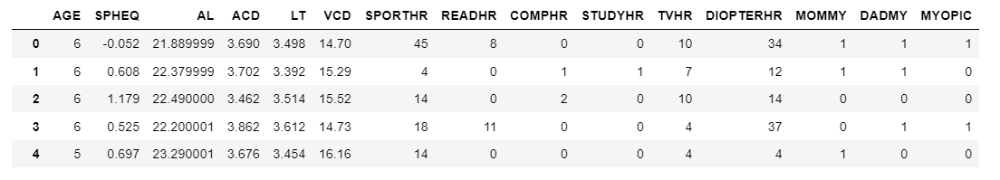
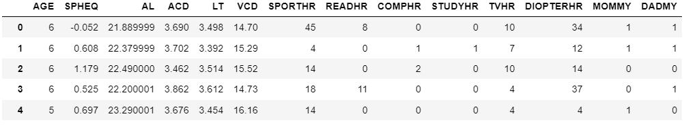
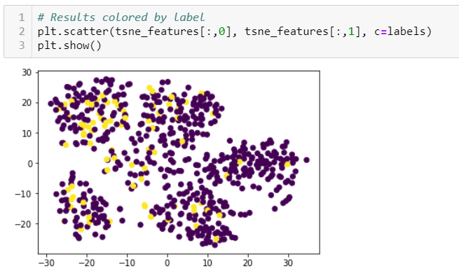
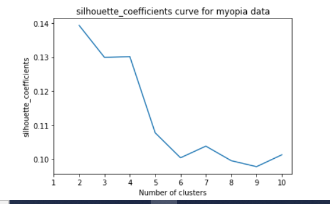

# Unit 20 Homework: Predicting Myopia

# Overview
Our company is interested in finding better ways to predict myopia, or nearsightedness. We have been provided with raw data, so we’ll first process it to fit the machine learning model. We will use K-means clustering algorithm to explore whether the patients can be placed into distinct groups (). Then, we’ll create a visualization to share our findings with our team and other key stakeholders.

# Methodology

### Data Preparation
* Read the csv into pandas

* Previewed the DataFrame - checked for nulls and duplicates
* Removed the MYOPIC column from the dataset

* Standardized the dataset using a scaler 
* Named the resulting DataFrame X 

### Dimensionality Reduction 
* PCA model was created and used to reduce dimensions of the scaled dataset 
* PCA model’s explained variance was set to 90% (0.9) 
* The shape of the reduced dataset was examined for reduction in number of features 
* t-SNE model was created and used to reduce dimensions of the scaled dataset 
* t-SNE was used to create a plot of the reduced features 

### Clustering 
A K-means model was created 
A for- loop was used to create a list of inertias for each k from 1 to 10, inclusive 
A plot was created to examine any elbows that exist 

A for- loop was used to create a list of silhouette_coefficients for each k 
A plot was created to examine silhouette_coefficients

# Conclusion
K-means clustering does NOT seem to be a good model to cluster the paitients as myopic/ non-myopic using this dataset. This conclusion is based on the following observations:
    * The tNSE scatter plot clusters are overlapping and there may be anywhere from 2-5 poorly defined clusters.
    * The elbow curve does not show a sharp bend at any point. It does show very shallow bends at 2, 3, 5 cluster numbers.
    * To further confirm, checked the silhouette_coefficients for each k value (the best value is 1 and the worst value is -1. Values near 0 indicate overlapping clusters). Since the silhouette_coefficients for all the k values are very close to 0, this confirms the overlapping clusters seen with tNSE scatter plot.
  
---
© 2022 edX Boot Camps LLC. Confidential and Proprietary. All Rights Reserved.
